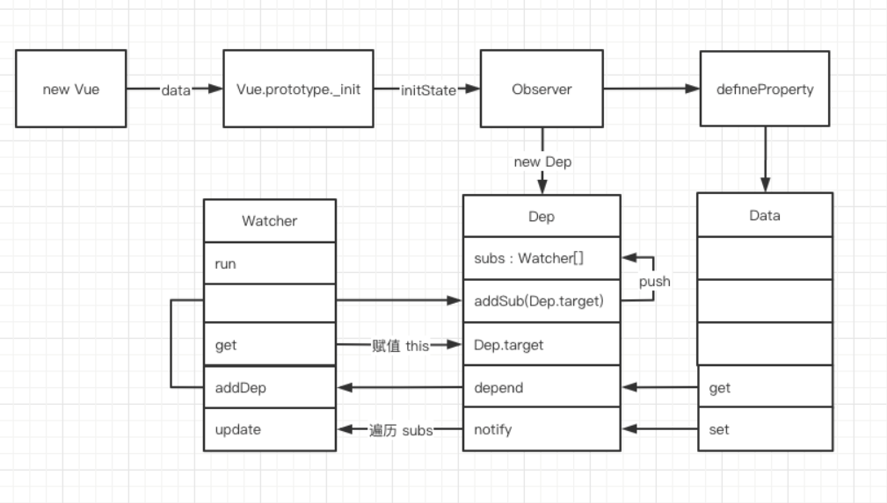

[TOC]


# 1. 准备工作

## 1. rollup打包js
-  只打包js, 打包结果简洁, 开发js库使用rollup, 项目webpack
```js
yarn add rollup rollup-plugin-babel @babel/core @babel/preset-env rollup-plugin-serve
```

## 2. rollup启动文件
> rollup.config.js
```js
import babel from 'rollup-plugin-babel'
import serve from 'rollup-plugin-serve'

export default {
  input: './src/index.js',
  output: {
    format: 'umd',
    name: 'Vue',
    file: 'dist/umd/vue.js',
    sourcemap: true
  },
  plugins: [
    babel({
      exclude: 'node_modules/**'
    }),
    serve({
      port: 3000,
      contentBase: '',
      openPage: '/index.html'
    })
  ]
}
```

## 3. .babelrc

> 将ES6 转换为ES5

```json
{
  "presets": [
    "@babel/preset-env"
  ]
}
```

## 4. package.json配置script

-c: 使用配置文件 -w: 检测文件修改变化并重启serve服务

```js
"dev": "rollup -c -w"
```


# 2. Vue初渲染

## 1. 从使用Vue入手分析Vue内部原理

```js
new Vue({
    el: '#app',
    data() {
        return {a: 1}
    },
    // ...
})
```

- 首先是个类class, class的特点是所有的实例方法和原型方法都写在class内部

```js
class Vue {
    a(){}
    b(){}
}
```

- 为了**更好的扩展**类的原型方法, 就是将原型方法分散到不同的文件中(模块中),采用构造函数的写法
- new Vue({...}) 会传递一些参数, 所以最一般的想法是, 根据这些options选项进行 **初始化**
- 初始化除了Vue实例需要, 以后的组件初始化也需要, 所以是一个公共方法, 原型上添加方法

```js
// vue2的options API
function Vue (options) {
    this._init(options)
}
// 初始化方法
Vue.prototype._init = function (options) {
    
}
```

## 2. 文件抽离为插件对原型的扩展

初始化方法写在index.js中不好管理, 因为除了Vue或者组件的初始化, 还有生命周期, 渲染等

都写在一个文件里不好管理 **拆分解耦为插件**


## 3. 源码结构

在Vue的入口文件index.js中, 用于扩展原型方法, 更高层的功能, 如初始化，生命周期，渲染。

至于初始化中的细节, 如初始化状态数据，事件vm.$emit等, 可以拆分为状态初始化，事件初始化两个文件, 在初始化模块中引入初始化的子模块功能. 如


## 4. 初始化

### 1. 插件模式

- 插件返回的都是一个方法, 传入Vue构造函数, 在构造函数的prototype上添加原型方法

- Vue和组件初始化/生命周期/渲染等

```js
function Vue (options) {
    this._init(options)
}
initMixin(Vue)

// init.js
export function initMixin (Vue) {
    Vue.prototype._init = function (options) {
        const vm = this
        vm.$options = options
        // ...
        return vm   // 因为new Vue有返回值为 const vm = new Vue({...})
    }
}
```

- 会将所有的options的属性都放在Vue实例上 vm.$options，最终返回这个vm实例

```js
Vue.prototype._init = function (options) {
    const vm = this
    vm.$options = options
    // ...
    return vm   // 因为new Vue有返回值为 const vm = new Vue({...})
}
```

### 2. Vue并不是一个MVVM框架

- MVVM条件：数据变化视图会更新，视图变化数据会被影响 （MVVM）不能跳过数据去更新视图，
- Vue: 内部参考了MVVM的原理, 并且增加了 $ref可以直接操纵DOM


### 3. 初始化状态(数据)

#### 1. 数据初始化劫持,改变数据更新视图

#### 2. 与数据相关的状态

- data
- props
- watch
- computed

#### 

### 4. 响应式数据原理

- 初始化data时, 进行观测data数据

```js
import { observe } from "./observer/index.js"

export function initState(vm) {
  const opts = vm.$options
  // 根据不同的选项, 做不同的拆分处理, data如何处理, props如何处理等
  if (opts.props) {
    initProps(vm)
  }
  if (opts.data) {
    initData(vm)
  }
}

function initProps() { }

// data数据的初始化操作, 数据劫持
function initData(vm) {
  let data = vm.$options.data
  // data可能是函数, 也可能是对象, 函数就直接执行,结果返回对象,赋值给vm也是为了可以通过vue实例获取到数据劫持后的数据(引用)
  vm._data = data = typeof data === 'function' ? data.call(vm) : data
  return observe(data)
}
```

- observer/index.js

1. data必须是对象, 不能是普通值, 没有意义
2. data不能是null

```js
// 观测数据的变化, 更新视图
export function observe(data) {
  
}
```

#### 1. 使用类来集中处理观测数据

> 因为观测数据可能会涉及到
>
> 1. 数组
> 2. 对象
> 3. 其他的方法
>
> 我们希望将这些方法耦合在一起，做成一个功能, 就需要做成class方式.
>
> 使用类class: 封装 继承

#### 2. 对象

##### 1. Object.defineProperty

遍历对象 对属性重新定义

```js
class Observer {
  constructor(value) {
    this.walk(value)
  }
  walk(data) {
    let keys = Object.keys(data)
    keys.forEach(key => {
      defineReactive(data, key, data[key])
    })
  }
}

function defineReactive(data, key, value) {
  Object.defineProperty(data, key, {
    get() {
      console.log('数据获取了')
      return value
    },
    set(newValue) {
      if (newValue === value) return
      console.log('数据设置了')
      value = newValue
    }
  })
}
// 观测数据的变化, 更新视图
export function observe(data) {
  // 只观测对象或数组
  if (typeof data !== 'object' || data == null) return
  return new Observer(data)
}
```


##### 2.  深层次递归对象属性

> 递归调用defineReactive(data)，上面的代码有一个问题: 只观测了data中对象的第一层属性，如果对象是嵌套的, 观测不到

```js
let vm = new Vue({
    el: '#app',
    data() {
        return { a: { a: { a: 1 } } }
    },
})
```

> 所以在观测data中每个属性的时候, 递归去观测, 如果对象的value还是对象, 继续

```js
function defineReactive(data, key, value) {
  observe(value) // 递归, observe内部有边界条件
  Object.defineProperty(data, key, {
    get() {
      console.log('数据获取了')
      return value
    },
    set(newValue) {
      if (newValue === value) return
      console.log('数据设置了')
      value = newValue
    }
  })
}
```

##### 3. 设置的值与原始值一致

如果对属性设置的值与原来的一致(return)

```js
set(newValue) {
    if (newValue === value) return
    console.log('数据设置了')
    value = newValue
}
```

##### 4. 设置的值是对象

> 以上代码没有检测到, 对vm._data.a = {name: 'hello'}; 如果修改name属性的值, 是没有监控到的

测试一下, 设置的name属性没有get set. 

```js
vm._data.a = { name: 'sanfeng' }	
console.log(vm._data.a)
vm._data.a.name = 'lisi'
console.log(vm._data.a.name)
console.log(vm._data)
```

修改原始代码 (设置的值递归)

```js
Object.defineProperty(data, key, {
    set(newValue) {
        if (newValue === value) return
        console.log('数据设置了')
        // 重新设置值时, 对设置的value也进行递归观测
        observe(newValue)
        value = newValue
    }
})
```


#### 3. 数据劫持思想

1. 深度遍历数据的所有属性, 使用Object.defineProperty设置属性的get set.
2. 对于多层次的对象, 继续对属性的value继续observe(value), 就实现了递归
3. 对数据重新设置的值如果是对象, 也要劫持. observe(newValue)


#### 4. 数组方法的拦截

##### 0. Object.create知识点

```js
// 获取数组的所有方法(从原型上获取)
let oldArrayProtoMethods = Array.prototype
// 继承 等同于 => arrayMethods.__proto__ === oldArrayProtoMethods
let arrayMethods = Object.create(oldArrayProtoMethods) // 通过原型创建一个对象,这个对象.__proto__可以找到数组原型方法
// 也就是 arrayMethods对象添加(重写)数组的某个方法, 就会按照重写的方法执行, 没有指定重写, 就顺着原型链查找Array原型上的方法


```

- **arrayMethods对象添加(重写)数组的某个方法, 就会按照重写的方法执行, 没有指定重写, 就顺着原型链查找Array原型上的方法**

```js
arrayMethod.push = function (...args) {}
arrayMethod.pop = function (...args) {}
```

- 其他对象通过原型链继承这个对象arrayMethods, 如果用到了push pop,就会执行重写的方法, 否则执行Array原型上的方法

- 将所有可以修改数组的方法进行重写，并将方法作为属性设置到arrayMethods对象上

  ```js
  Array {push: ƒ}
      push: ƒ ()
  	pop: f()
      __proto__: Array(0)
          concat: ƒ concat()
          constructor: ƒ Array()
          copyWithin: ƒ copyWithin()
          entries: ƒ entries()
          every: ƒ every()
          fill: ƒ fill()
  ```

  

> 举例

```js
// 数组的原型对象
let oldArrayProtoMethods = Array.prototype

// 根据原型对象创建对象, 继承的数组的原型上的方法, 都挂载到新对象arrayMethod的原型链上__proto__, 可以通过arrayMethods.push, 直接方法, 原型链查找
let arrayMethods = Object.create(oldArrayProtoMethods)

let methods = [
  'push',
]
// 将所有可以修改数组的方法进行重写，并将方法作为属性设置到arrayMethods对象上
methods.forEach(method => {
  arrayMethods[method] = function () {
    console.log('数组操作执行了')
    oldArrayProtoMethods[method].apply(this, arguments)
  }
})

let arr = [1, 2]
arr.__proto__ = arrayMethods	// 数组 原型链继承 查找
// 等价 ES6写法
// Object.setPrototypeOf(arr, arrayMethods)

arr.push(3, 4, 5)
console.log(arr)

arr.pop()
console.log(arr)
```


##### 1. 数组类型的数据(劫持方法)

```js
data () {
    return {
        arr: [1,2,3]
    }
}
```

- 我们开发功能时很少对数组索引进行操作,为了性能考虑不对数组进行拦截，不拦截数组元素的每一项做set get
- 拦截可以改变数组的方法进行操作, 改变自己的方法重写掉, 就知道了数据变化了，我再通知你, 数据变化了
- 重写可以改变数组自身的方法，只有监控可改变自身的方法, 就知道了数据变化了, AOP, 函数劫持
- **函数劫持, AOP: 先做一些自己的事, 然后调用数组原有的方法**
- array.js

```js
let oldArrayProtoMethods = Array.prototype
// 外部引用被继承的 重写了 改变数组数据的7个方法的 对象  根据Array的原型创建对象
export let arrayMethods = Object.create(oldArrayProtoMethods)

// 需要重写数组的方法(可以改变数组的方法)
let methods = [
    'push',
    'pop',
    'shift',
    'unshift',
    'splice',
    'reverse',
    'sort'
]

methods.forEach(method => {
    arrayMethods[method] = function () {
        // 切面编程: 做点特殊的事情之后, 再调用原本执行的方法
        console.log('数组被修改了,开始视图更新')
        // 原本的方法执行 oldArrayProtoMethods.push...
        // apply(this, arguments)是为了解决 arr.push(1,2,3,4) push多个元素
        let result = oldArrayProtoMethods[method].apply(this, arguments)
        return result
    }
})

```


##### 2. 数组元素是对象(初始状态)

如果数组内的元素是对象, 也需要进行观测, 对数组中的每一项进行观测 this.observeArray(value)

```js
constructor(value) {
    // 如果是数组, 不观测每一项
    if (Array.isArray(value)) {
        // value如果是数组, 继承指向重新的数组方法，通过原型链继承
        value.__proto__ = arrayMethods
        this.observeArray(value)
    } else {
        this.walk(value)
    }
}

// +++ 观测数组中的每一项, 如果数组中的对象, 进行get set
observeArray(value) {
    value.forEach(item => {
        // 观测数组中的对象类型 observe方法就是观测的对象！
        observe(item)
    })
}
```

- 测试

`console.log(vm._data.arr)` 

> 1. 数组的元素没有get set
> 2. 元素对象属性进行了劫持 get name set name
> 3. [{…}]0: name: (...)get name: ƒ ()set name: ƒ (newValue)__proto__: Objectlength: 1__proto__: Array


##### 3. 给数组添加对象元素(新增)

也是拦截不到, 因为push的元素没有observe，因为操作的元素可能也是个对象

```
vm._data.arr.push({a: 1})
vm._data.arr[1].a
```

添加的元素也需要进行观测, 所以对于新增的函数方法需要进一步处理

```js
methods.forEach(method => {
    arrayMethtods[method] = function (...args) {
        const result = oldArrayProtoMethods[method].apply(this, args)
        let inserted;	// 保存新增的对象数组
        // 判断如果涉及到新增的操作 push,unshift,splice,需要将调用传递的参数进行保存, 并实施"观测"
        switch(method) {
            case 'push':
            case 'unshift':
                inserted = args
            case 'splice':
                inserted = args.slice(2);   // 从第二个参数截取到参数列表结束 arr.splice(0, 1, {a:10}, {b: 2})
            default:
                break;
        }
        // 
        if (inserted) {
            observeArray(inserted)		// ???? 如何在array.js中引用observer中的实例方法？？？
        }
    }
})
```

- 如何在array.js中引用observer中的实例方法

1. 因为在arrayMethods[method]函数中的this就是被观测的数组元素, 
2. 在Observer类中, 构造函数中的value也是数组元素
3. 我把Observer类的观测数组的方法 observeArray 或者Observer实例挂载到数组元素上, 在arrayMethods[method]函数中就可以了
4. `value.__ob__ = this`是错误写法，死循环

##### 5. 最终写法

```js
methods.forEach(method => {
  // 重新定义数组的方法, 重写上面的7个方法
  arrayMethods[method] = function (...args) {
    // 切面编程: 做点特殊的事情之后, 再调用原本执行的方法
    console.log('数组方法重写了，更新视图')
    // 原本的方法执行
    const result = oldArrayProtoMethods[method].apply(this, arguments)
    let inserted;
    let ob = this.__ob__
    // 监控新增对象
    switch (method) {
      case 'push':
      case 'unshift':   // 这两个方法都是追加 追加的内容可能是对象类型，应该被再次进行劫持
        inserted = args
        break;
      case 'splice':
        inserted = args.slice(2)  // arr.splice(0, 1, {a: 100}) // 数组下标0的位置 删除1个, 并用对象{a: 100}填补这个位置 => 新增
      default:
        break;
    }
    // 将观测对象的方法, 挂载到实例的属性__ob__上
    if (inserted) {
      ob.observeArray(inserted)
    }
    return result
  }
})
```

- Observer类

```js
import { arrayMethods } from "./array"

class Observer {
  constructor(value) {
    Object.defineProperty(value, '__ob__', {
      enumerable: false,    // 不可枚举, 如果配置为可枚举 
      configurable: false,
      value: this     // Observer实例
    })
    // value.__ob__ = this

    // 如果是数组, 不观测每一项
    if (Array.isArray(value)) {
      // value如果是数组, 继承指向重新的数组方法，通过原型链继承
      value.__proto__ = arrayMethods
      this.observeArray(value)
    } else {
      this.walk(value)
    }
  }

  // 观测数组中的每一项, 如果是对象就进行观测
  observeArray(value) {
    value.forEach(item => {
      // 观测数组中的对象类型
      observe(item)
    })
  }

  walk(data) {
    let keys = Object.keys(data)
    keys.forEach(key => {
      defineReactive(data, key, data[key])
    })
  }
}

function defineReactive(data, key, value) {
  // 递归观察data嵌套的对象
  observe(value)
  Object.defineProperty(data, key, {
    get() {
      console.log('数据获取了')
      return value
    },
    set(newValue) {
      if (newValue === value) return
      console.log('数据设置了')
      // 给data属性设置一个对象,设置的对象也需要进行观测
      observe(newValue)
      value = newValue
    }
  })
}

// 观测数据的变化, 更新视图
export function observe(data) {
  if (data.__ob__) return
  // 只观测对象或数组
  if (typeof data !== 'object' || data == null) return
  return new Observer(data)
}
```


#### 5. 思路总结

观测数据时

1. 如果是数组, 就把当前这个数组的方法重写掉(7个可以改变原始数组的方法)，并且去观测数组中的每一个元素。
2. 循环遍历数组的每一项, 如果元素是对象类型，就调用观测对象的方法observe(value)
3. 当调用数组的新增方法时, 需要对新增的结果(对象或者数组,或者普通值...)再次进行观测, 观测的值肯定是个数组，所以再次调用observeArray(value)
4. observeArray方法是Observer的方法, 我们给被观测的value值添加一个属性, 属性指向Observer实例,那么这个实例就有了observeArray方法
5. 当数组调用push,unshift等方法的定义时, this就是被观测的值, 其上面就有`__obj__`属性，`__ob__`的value就是Observer实例

#### 

### 5.属性代理

> 观测完了data, 对象，数组, 数组中是对象, get set方法之后, 用户获取数据的方式是 vm._data.arr
>
> 我们希望通过 vm.arr就获取到数组   ==> 代理

```js
// data数据的初始化操作, 数据劫持
function initData(vm) {
  // ...
  // 当我去vm上取属性时 ，帮我将属性的取值代理到vm._data上
  for (let key in data) {
    proxy(vm, '_data', key)
  }
  observe(data)
}
```

- utils.js

```js

export function proxy(vm, data, key) {
  Object.defineProperty(vm, key, {
    get() {
      return vm[data][key]
    },
    set(newValue) {
      vm[data][key] = newValue
    }
  })
}
```

### 6.响应式原理梳理总结

Vue 任务5最后的总结流程


## 4. 数据渲染到页面

### 0. 目录结构

- compiler负责解析模板,生成render函数的所有功能  => 编译工作
- compiler/index.js 引用了parseHTML
- parse.js：解析html，生成ast


渲染的操作 

1. 默认会先找render方法
2. 默认没有传入render方法会查找template 
3. 找当前el指定的元素中的内容来进行渲染

```js
let vm = new Vue({
    // 3
    el: '#app',
    data() {
        return { arr: [{ name: 'hello' }] }
    },
    // 1
    render(h) {
        return h('div', { id: 'a' }, 'hello')   // 元素, 属性, 内容
    },
    // 2
    template: `<div id="a">hello</div> `
})
```

问题是: 这个render和template怎么渲染到页面上的呢? **AST：抽象语法树**

**数据的渲染肯定也是在初始化中处理, initMixin(Vue)**

### 1. 获取模板内容

```js
function initMixin() {
    // ...
    if (vm.$options.el) {
        vm.$mount(el)	// 挂载页面
    }
}

// 初始化数据之后的挂载操作
Vue.prototype.$mount = function (el) {
    const vm = this
    const options = vm.$options
	el = document.querySelector(el)
    // 查找模板的过程, 实例上没有render函数, 看有没有template, 如果没有, 再看有没有el元素
    // render, template, el 用户定义时必须传一个
    if (!options.render) {
        let template = options.template;
        if (!template && el) {
            template = el.outerHTML
        }
        // 把模板编译为render函数
        let render = compileToFunction(template)
        options.render = render
    }
}
```

> 为什么使用outerHTML而不是innerHTML

- 最终是创建一个全新的元素(div), 通过AST解析, 把模板进行编译成render函数, dom diff等对比, 生成全新的元素, **替换掉**原有的#app的div

- outerHTML: 包含了外层的<div id="app">
- innerHTML: 不包含<div id="app">


### 2. 编译模板为render方法

- 将html代码转换为render函数
  1. 将html代码转化成 AST语法树, AST用来描述语言本身的。比如可以用AST描述html代码，js代码(jsx)，
  2. 优化静态节点
  3. 通过这课树 重新的生成代码

> 代码生成，代码转义，eslint, webpack, 都使用了AST

#### 1. AST树与虚拟DOM的区别

> AST: 对语法，对语言本身进行转义
>
> 虚拟DOM: 对DOM结构进行转义, 可自定义属性

- **AST树是针对语言本身的, 即可描述DOM, 也可以是js，但是不能自定义添加属性, 描述的html或js有规范**

>  AST描述DOM

```html
<div id="a"></div>
```

```js
{
	tag: 'div',
    attrs: [{id: 'a'}],
    children: []
}
```

>  AST描述js

```js
const a = 1
{
    indentifier: const,
    name: a,
    value: 1
}
```

- **虚拟DOM: 只用来描述DOM, 可以给虚拟DOM自定义添加属性**

> 用对象来描述节点

```js
{
    tag: div,
    div: {data: [1,2,3]}
}
```

#### 2. 将html转换为AST树

> 内部原理: 正则
>
> 1. 解析标签, 标签之间的父子关系

将html模板转换为

```html
<div id="app">hello {{name}} <span>world</span><p></p></div>
```

```
{
    tag: 'div',
    parent: null,
    type: 1,
    attrs: [{id: 'app'}],
    children: [
    	{tag: null, parent: 父div, attrs: [], text: hello {{name}}},
    	{tag: 'span', parent: 父div, attrs: [], text: world},
    	...
    ]
}
```

**正则匹配 匹配一点, 截取一点, 删除一点, 直到匹配完了，就形成了AST树解析标签，属性，文本**

##### 1.  init.js初始化渲染挂载时编译模板

```js
Vue.prototype.$mount = function (el) {
	// ...
	const render = compileToFunctions(el)	// 模板编译
    options.render = render
}
```

##### 2. compileToFunctions

```js
import { parseHTML } from "./parse";
export function compileToFunctions(template) {
  // 将模板字符串解析成AST语法树
  let ast = parseHTML(template)
}
```

##### 3. parse.js

> 如果有模板字符串, 通过正则匹配
>
> 1. 解析开始标签以及属性 parseStartTag()

```js
const ncname = `[a-zA-Z_][\\-\\.0-9_a-zA-Z]*`; // 标签名 ?:匹配不捕获
const qnameCapture = `((?:${ncname}\\:)?${ncname})`; // </my:xx>
const startTagOpen = new RegExp(`^<${qnameCapture}`); // 标签开头的正则 捕获的内容是标签名
const endTag = new RegExp(`^<\\/${qnameCapture}[^>]*>`); // 匹配标签结尾的 </div>
const attribute = /^\s*([^\s"'<>\/=]+)(?:\s*(=)\s*(?:"([^"]*)"+|'([^']*)'+|([^\s"'=<>`]+)))?/; // 匹配属性的    aaa="aaa"  a='aaa'   a=aaa
const startTagClose = /^\s*(\/?)>/; // 匹配标签结束的 >    >   <div></div>  <br/>
const defaultTagRE = /\{\{((?:.|\r?\n)+?)\}\}/g;

export function parseHTML(html) {
  while (html) {
    // 解析开始标签 <div id="app" name="xxx">
    // 查找到 "<"
    let textEnd = html.indexOf('<')
    if (textEnd == 0) {
      // 解析开始标签
      const startTagMatch = parseStartTag()
    }
  }

  function parseStartTag() {
    const start = html.match(startTagOpen)
    console.log(start)
  }
}
```

正则匹配的结果的start结果: console.log(start)

```js
0: "<div"
1: "div"
groups: undefined
index: 0
input: "<div id="app" style="color:red">↵    <p>hello world zf</p>↵    <li>↵      {{school.name}}↵    </li>↵    <li>↵      {{school.age}}↵    </li>↵  </div>"
length: 2
```

###### 1. 开始标签的处理 

> 1. **parseStartTag(核心)**
> 2. **收集html的标签以及标签中的属性**
> 3. attr[3]: 属性值是双引号括起来的值 id="app"; attr[4]: 单引号; attr[5]: 没有引号
>
> 4. 如果有开始标签<, 收集标签元素和属性, 形成对象 match, 然后删除匹配到的标签和属性

```js
// 解析开始标签 <div id="app" name="xxx">
function parseStartTag() {
    const start = html.match(startTagOpen)
    // start[0] => "<div"
    if (start) {
        // 保存标签和属性
        const match = {
            tagName: start[1],
            attrs: []
        }
        // 匹配完了就要删除
        advance(start[0].length)
        let end, attr
        // 处理开始标签的属性 如果没有遇到结束标签的标识符">", 并且匹配到了属性, 
        // 就将匹配到的attr保存到match对象上, 最终return
        while (!(end = html.match(startTagClose)) && (attr = html.match(attribute))) {
            match.attrs.push({
                name: attr[1],
                value: attr[3] || attr[4] || attr[5]
            })
            // 匹配完继续删除
            advance(attr[0].length)
        }
        // 最终就剩下 ">"
        if (end) {
            advance(end[0].length)
            return match
        }
    }
}

function advance(n) {
    html = html.substring(n)
}
```


###### 2. 结束标签的处理

如果没有匹配到开始标签, 比如</div>, </p>这样的结束标签, 就匹配结束标签

```js
while {
    let textEnd = html.indexOf('<')
    if (textEnd == 0) {
        // 开始标签匹配与信息收集(标签和属性)...
        // 结束标签
    	const endTagMatch = html.match(endTag)
        if (endTagMatch) {
            // 删除
            advance(endTagMatch[0].length)// <div>
            end(endTagMatch[1])    // 将结束标签传入 
            continue
        }
    }
}

```


###### 3. 文本的处理

> textEnd > 0 说明html的开头不是以<开始的, 也就不是标签, 肯定是文本

```js
// 如果是文本保存并
let text
if (textEnd > 0) {
    text = html.substring(0, textEnd)
}
// 如果有> 截取删除
if (text) {
    advance(text.length)
    chars(text)     // 处理文本 hello {{name}}
}
```


###### 4. 创建AST

> 前面处理的是html的字符串, 收集信息形成对象。然后我们要**根据这些对象生成AST**.

1. 创建AST树, 属性对象
2. 在start, chars, end中考虑创建
3. 最终解析了html,形成了对象,根据对象生成了ast, 最终return 的就是ast

```js
export function parseHTML (html) {
    function createASTElement (tagName, attrs) {
        return {
            tag: tagName, // 标签名
            type: 1, // 元素类型
            children: [], // 孩子列表
            attrs, // 属性集合
            parent: null // 父元素
        }
    }
}
```

4. 开始，结束，文本处理函数中, 解析html文本生成对象, 然后生成AST

```js
let root;
let currentParent;
let stack = [];
function start(tagName, attrs) { // 创建一个元素 作为根元素
    let element = createASTElement(tagName, attrs);
    if(!root){
        root = element;
    }
    currentParent = element; // 当前解析的标签 保存起来
    stack.push(element); // 将生产的ast元素放到栈中
}
```

```js
// 文本
function chars(text) {
    text = text.trim();
    if(text){
        currentParent.children.push({
            type:3,
            text
        })
    }
}
```

```js
// 结束标签

```

###### 5. 校验原始html标签的准确性

合法的 `<div><p>hello</p></div>`

**不合法**<font color="red">`<div><p>hello</div>`</font>, 但是发现, 浏览器会补全结束标签</p>

```js
// 结束标签处理 </div>
// 1. 记录结束标签的父亲
// 2. 当前标签父亲的儿子是谁
// 3. 结束标签建立父子关系 
function end(tagName) {
    // console.log("end....", tagName)
    let ele = stack.pop()   // 取出栈中的最后一个
    currentParent = stack[stack.length - 1]
    if (currentParent) {
        ele.parent = currentParent
        currentParent.children.push(ele)
    }
}
```

`<div><p>hello</p></div>`

过程: 第3步操作的是start中push进去的ast元素 => { tag: xxx, parent:xxx, children:..., type: 1, attrs: [{...}]}

1. [div]
2. [div, p]
3. ele = p; currentParent == div; p.parent = div; div.children.push(p)

###### 6. 总结

start: 创建AST元素, 记录AST元素的出入栈

chars: 记录文本内容组成的对象 {type: 3, text} push到 文本父级的children属性中

end: 结束标签, pop栈, pop之后把最后一个元素作为currentParent, 维护父子结构, 实现互记功能


#### 3. 代码生成generate

>  根据ast树生成render函数字符串

> 1. 原始html: <div id="app" style="color:red"> hello {{name}} <span>hello</span></div>
> 2. 转换ast: { tag: 'div', type: 1, children: [{type: 3, text: 'hello {{name}}'}], attrs: [{id: 'app'}, {style: "color: red"}]}
>
> 以上两个步骤已经实现了, 代码生成时将ast转换为**render函数的字符串**
>
> 3. ```js
>    render(){
>    	return _c('div',{id:'app',style:{color:'red'}},_v('hello'+_s(name)),_c('span',null,_v('hello')))
>    }
>    ```
>
> 4. 描述
>    1. _c: 创建元素
>    2. _v: 创建文本
>    3. _s: JSON.stringify 用于{{}}中如果是对象, 将对象转换为字符串显示在页面上

生成的结果

```bash
_c(元素名, 属性列表, 文本)
```

```js
let code = _c(div, {id:"app",style:{"color":"red","fontSize":"16px"}})
```

##### 1. 处理元素

> _c(${ast.tag}

```js
export function generate (ast) {
    // 如果有属性, 生成属性
    let code = `_c('${ast.tag}', ${ast.attrs.length ? `${genProps(ast.attrs)}`: undefined})`
    return code
}
```

#####  2. 处理属性 genProps

```js
function genProps (attrs) {
    let str = ''
	for (let i = 0; i < attrs.length; i++) {
        let attr = attrs[i]
        // 样式要单独处理: style是对象转换成对象字符串; 其他属性, 就是key:value的形式
        if (attr.name === 'style') {
            attr.value.split(';').forEach(item => {
                let obj = {} // 用于后续组和成对象, 再对obj进行JSON.stringify
                let [key, value] = item.split(':')
                obj[key] = value
            })
            attr.value = obj
        }
        // 兼容性处理 value是对象的情况,每个属性之间用","分割 color和fontSize之类的逗号
        str += `${attr.name}: ${JSON.stringify(attr.value)},`	
    }    
    return `{${str.slice(0, -1)}}`	// 属性是个对象,外层要包裹{}, 把最后的一个逗号删除
}
```

##### 3. 处理孩子children

```js
function genChildren(ast) {
  const children = ast.children
  if (children) {
    return children.map(child => gen(child)).join(',')
  }
}

export function generate(ast) {
  // console.log("ast: ", ast)
  let children = genChildren(ast)  // 生成儿子
  // `,${children}` 前面的, 要注意细节
  let code = `_c('${ast.tag}', ${ast.attrs.length > 0 ? `${genProps(ast.attrs)}` : 'undefined'} ${children ? `,${children}` : ''})`
  console.log("code: ", code)

  return code
}
```


```js
// 编写<div id="app" style="color:red"> hello {{name}} <span>hello</span></div>

// 结果:render(){
//    return _c('div',{id:'app',style:{color:'red'}},_v('hello'+_s(name)),_c('span',null,_v('hello')))
//}
const defaultTagRE = /\{\{((?:.|\r?\n)+?)\}\}/g;
//  语法层面的转义
function genProps(attrs) { //  id   "app"     / style  "fontSize:12px;color:red"
    let str = '';
    for (let i = 0; i < attrs.length; i++) {
        let attr = attrs[i];
        if (attr.name === 'style') {
            let obj = {}; // 对样式进行特殊的处理 
            attr.value.split(';').forEach(item => {
                let [key, value] = item.split(':');
                obj[key] = value;
            });
            attr.value = obj;
        }
        str += `${attr.name}:${JSON.stringify(attr.value)},`;
    }
    return `{${str.slice(0,-1)}}`;
}
// children代码生成
function gen(node) {
    if (node.type == 1) {
        return generate(node); // 生产元素节点的字符串
    } else {
        let text = node.text; // 获取文本
        // 如果是普通文本 不带{{}}

        if(!defaultTagRE.test(text)){
            return `_v(${JSON.stringify(text)})` // _v('hello {{ name }} world {{msg}} aa')   => _v('hello'+_s(name) +'world' + _s(msg))
        }
        let tokens = []; // 存放每一段的代码
        let lastIndex = defaultTagRE.lastIndex = 0; // 如果正则是全局模式 需要每次使用前置为0
        let match,index; // 每次匹配到的结果

        while(match = defaultTagRE.exec(text)){
            index = match.index; // 保存匹配到的索引
            if(index > lastIndex){
                tokens.push(JSON.stringify(text.slice(lastIndex,index)))
            }
            tokens.push(`_s(${match[1].trim()})`);
            lastIndex = index+match[0].length;
        }
        if(lastIndex < text.length){
            tokens.push(JSON.stringify(text.slice(lastIndex)));
        }
        return `_v(${tokens.join('+')})`;
    }
}
function genChildren(el) {
    const children = el.children;
    if (children) { // 将所有转化后的儿子用逗号拼接起来
        return children.map(child => gen(child)).join(',')
    }
}
export function generate(el) {
    let children = genChildren(el);// 儿子的生成
    let code = `_c('${el.tag}',${
        el.attrs.length? `${genProps(el.attrs)}`:'undefined'
    }${
        children?`,${children}`:''
    })`;
    return code;
}
```

- 正则匹配的一个细节点

```js
let reg = /a/g
reg.test('ab')  // true
reg.test('ab')  // false
reg.test('ab')  // true
reg.test('ab')  // false
reg.test('bbbbabcccc') //true
reg.lastIndex === 5
```

> 因为正则匹配后, lastIndex进行修改为匹配的位置, lastIndex就不是从0开始匹配了, 所以, 每次遍历数组的一项完成后, 都要将lastIndex重新设置为0


##### 4. 流程

1. 创建标签 _c("div")
2. 标签如果有属性, 就把属性进行拼接，拼接成对象返回出去
3. 如果有儿子，把儿子也拼接到后面，
   1. 看看类型如果是1，继续调用generate方法走流程1的**元素生成**递归调用
   2. 如果类型是3，是文本, 就拼接_v(${JSON.stringify(text)}) => _v('hello' + _s(name))
      1. 不能使用toString的原因是: toString后, 字符串也是没有双引号的
   3. 如果是文本, 并且有大括号的情况, 拼接成_s(value)


#### 4. 流程简单总结

- tempalte转成render，解析html模板，生成ast树，根据ast树(就是个对象), 重新生成代码, 增加with 和函数
- 生成的render函数就可以被调用, 渲染节点，最终扔到页面上


### 3. 渲染到页面

#### 1. 创建虚拟DOM

##### 1.  初始化initMixin的挂载操作$mount

> mountComponent 属于生命周期的一部分

```js
import { mountComponent } from './lifecycle'

Vue.prototype.$mount = function (el) {
    // 挂载组件 属于生命周期的一部分 (创建VDOM和渲染真实节点的开始 vm上有render, el是被替换的DOM节点)
    mountComponent(vm, el)
}

```

##### 2.  核心方法入口

1. 生成虚拟DOM => vm._render() 
2. 渲染真实节点vm._update
3. 都是vm实例上的方法， render和update都是组件生命周期的一部分，抽离成一个lifecycle文件转换处理生命周期, 理念上与初始化平级别 init - lifecycle

```js
// lifecycle.js
export function mountComponent(vm, el) {
  vm._update(vm._render())
}

// 使用插件mixin
export function lifecycleMixin (Vue) {
    Vue.prototype._render = function () {
        const vm = this
        let render = vm.$options.render
        return render.call(vm)   // 此时就会报错 因为render函数中, with中没有_c, _v, _s
    }
}
```


##### 3. 解决Vue实例上没有_c, _v, _s方法问题

这些方法都属于, 从ast语法树拼接成字符串函数, 然后调用之后, 找不到_c这个函数导致的, 调用的函数为了什么呢?

<font color="red" size="6">**生成虚拟DOM  VDOM**</font>

> vdom/index.js

```js
export function renderMixin(Vue) {
  // 生成虚拟DOM
  // _c(div, {id:"app",style:{"color":"red"}} ,_c(p, undefined ,_v("hello world zf"+_s(school.name))))
  Vue.prototype._c = function () {  // 创建虚拟dom元素
    return createElement(...arguments)
  }

  // 创建虚拟dom文本元素
  Vue.prototype._v = function (text) {
    return createTextVnode(text);
  }
  // stringify
  Vue.prototype._s = function (val) {
    return val === null ? '' : typeof val === 'object' ? JSON.stringify(val) : val
  }
}

// 其实还是根据ast对象树 生成vdom
function createElement(tag, data = {}, ...children) {
  return vnode(tag, data, data.key, children)
}

function createTextVnode(text) {
  return vnode(undefined, undefined, undefined, undefined, text)
}
// 用来产生虚拟dom的
function vnode(tag, data, key, children, text) {
  return {
    tag, data, key, children, text
  }
}
```


#### 2. 渲染真实节点

> 核心方法vm.update(vdom)

```js
export function mountComponent(vm, el) {
  vm._update(vm._render())
}
```

生命周期函数中定义插件, 核心就是_update

```js
export function lifecycleMixin(Vue) {
  // 渲染页面 根据vdom生成
  Vue.prototype._update = function (vdom) {
    // console.log("vdVue.prototype._update vdom: ", vdom)
    const vm = this
    // 根据新的vnode生成DOM元素, 替换老的DOM元素
    patch(vm.$el, vnode) // vm.$el
  }
}
```

在index.js中调用

```js
lifecycleMixin(Vue)
```


##### 1. patch核心方法(vdom->DOM)

```js

export function patch(oldVnode, vnode) {
  // 将虚拟节点转化成真实节点
  let el = createElm(vnode); // 产生真实的dom 
  let parentElm = oldVnode.parentNode; // 获取老的app的父亲 =》 body
  parentElm.insertBefore(el, oldVnode.nextSibling); // 当前的真实元素插入到app的后面
  parentElm.removeChild(oldVnode); // 删除老的节点
  return el
}

function createElm(vnode) {
  let { tag, children, key, data, text } = vnode;
  if (typeof tag == 'string') { // 创建元素 放到vnode.el上
    vnode.el = document.createElement(tag);
    children.forEach(child => { // 遍历儿子 将儿子渲染后的结果扔到父亲中
      vnode.el.appendChild(createElm(child));
    })
  } else { // 创建文件 放到vnode.el上
    vnode.el = document.createTextNode(text);
  }
  return vnode.el;
}
```

##### 2. init中 挂载dom节点

```js
Vue.prototype.$mount = function (el) {
    el = document.querySelector(el)
	vm.$el = el			// 给实例添加属性, 方便patch方法获取真实的DOM节点 app
}

```

##### 3. 更新属性

通过虚拟DOM创建的DOM节点, 还没有处理属性

```js
function createElm(vnode) {
    // ...
	updateProperties(vnode)
}
```

```js
// 根据虚拟节点的data属性, 更新DOM的attrs
function updateProperties(vnode) {
  let el = vnode.el
  let newProps = vnode.data || {}
  for (let key in newProps) {
    if (key === 'style') {
      // style属性是个对象
      for (let styleName in newProps.style) {
        el.style[styleName] = newProps.style[styleName]
      }
    } else if (key === 'class') {
      el.className = el.class
    } else {
      el.setAttribute(key, newProps[key])
    }
  }
}
```


## 5. 初始化总结

### 1. Vue原型方法的插件式划分

1. new Vue({})或者创建组件都会调用 Vue构造函数的 _init方法进行初始化, **入口**
2. Vue的功能非常多, 我们把很多的方法都扩展到Vue的原型上 Vue.prototype._init, Vue.prototype.$mount...
3. 扩展的这些方法采用插件的方式,把每一个原型的方法都分开去写, 如Vue.prototype._init，$mount
4. 每个插件的功能一个主题, 如init.js负责初始化, lifecycle.js负责生命周期(这里指的是组件的render函数生成与挂载到页面，并不是created, mount等生命周期 ) 是组件的生命周期, 值的是组件的更新，渲染，挂载

### 2. 初始化状态

5. initMixin中初始化_init， **初始化状态**，**组件的挂载**
6. 初始化状态
   1. 数据挂载到vm._data, options.data如果是function, 执行拿到结果
   2. 数据代理到vm上例 proxy中实现Object.defineProperty
   3. 观测数据 observe(data)，对data以及其中的属性以及值进行劫持, 只劫持**对象或数组**。当数据发生改变后, 实现页面的更新
      1. Vue2.x重写属性的get set也是有缺陷的. 因为属性可能是对象套对象, 就会递归观测 **响应式原理的核心**
      2. observe **只针对存在的属性进行了观测**. 如data: {a: 1}, 重写了属性a 的get set. 但是如果vm.b = 3是不进行观测的
      3. vm.$set是可以实现vm.c进行拦截进行观测， 原理是数组的splice, 劫持数组的splice方法
      4. 数组中更改索引和数组长度, 无法被监控. 因为observe劫持的是数组的元素的方法，只劫持元素是对象类型，length是数组的一个属性
      5. 如果实例属性是对象, 可以被监控 vm.a = { name: 'hello'}
   4. 使用类的方式: 
      1. 可以清楚的知道这个属性是哪个类的实例 
      2. 观测数据的功能是高内聚的

### 3. 组件挂载到页面

7. 初始化的组件的挂载 $mount
   1. 模板查找。依次查找用户定义的模板 render函数, template, 外部template(outerHTML)。

      el必须存在, 不存在都不知道渲染完挂载到页面的哪个DOM节点上

   2. 模板编译 compileToFunction对template进行编译

      1. 解析template, parse为AST对象，通过正则, 在语言语法层面进行解析为AST对象
      2. 根据AST，拼接字符串的方式, 代码生成codeGen, 生成render方法的字符串表示
      3. 使用new Function把render方法的字符串表示进行包装, 形成函数定义进行返回

   3. 组件挂载。
   
      1. mountComponent(vm, el)。传递vm方便获取实例上的数据, el是挂载节点。如果是子组件是空
      2. 调用vm._render(), render函数内部定义了``` _c, _v, _s``` 属于render阶段在Vue原型扩展的方法，最终返回VDOM
      3. 调用vm._update(VDOM): 生成真实DOM
   
8. 插件式组件生命周期(_render, _update)

9. render的Vue的原型方法 生成虚拟DOM `_c, _v, _s` 插件

10. patch: 更新成真实DOM: 创建真实DOM, 更新属性, 事件等，最终插入到老的节点前面，删除老的DOM，完成节点替换

```js
Vue.prototype._init = function (options) {
    // 选项挂载到vue实例上
    const vm = this
    vm.$options = options
    // 初始化中一个个不同的功能
    // 1. 数据的初始化: 初始化状态, 数据响应式, 数据变更, 视图更新, 数据劫持
    initState(vm)
    // 2. 初始化事件
    // 3. 数据渲染到页面
    // 如果有el属性, 说明需要渲染页面
    if (vm.$options.el) {
        vm.$mount(vm.$options.el)
    }
}
```

- initState

```js
import { observe } from "./observer/index.js"
import { proxy } from "./utils.js"

export function initState(vm) {
  const opts = vm.$options
  // 根据不同的选项, 做不同的拆分处理, data如何处理, props如何处理等
  if (opts.props) {
    initProps(vm)
  }
  if (opts.data) {
    initData(vm)
  }
}

function initProps() { }

// data数据的初始化操作, 数据劫持
function initData(vm) {
  let data = vm.$options.data
  // data可能是函数, 也可能是对象, 函数就直接执行,结果返回对象,赋值给vm也是为了可以通过vue实例获取到数据劫持后的数据(引用)
  vm._data = data = typeof data === 'function' ? data.call(vm) : data

  // 当我去vm上取属性时 ，帮我将属性的取值代理到vm._data上
  for (let key in data) {
    proxy(vm, '_data', key)
  }
  observe(data)
}
```

- 将vm._data上的属性代理到vm这个实例上,简化方便操作 utils.js

```js
export function proxy(vm, data, key) {
    Object.defineProperty(vm, key, {
        get () {
            return vm[data][key]
        },
        set (newValue) {
            vm[data][key] = newValue
        }
    })
}
```

- observe(data) **观测数据**, data是被逐层探查的，重写属性的get set方法  observer/index.js

```js
export function observe(data) {
	if (data.__ob__) return
    if (typeof data !== 'object' || data == null) return
    return new Observer(data)
}
```

- Observer类

```js
import { arrayMethods } from "./array"
import { definePropertyWithoutEnumerable } from "../utils"

class Observer {
  constructor(value) {
    definePropertyWithoutEnumerable(value, '__ob__', this)  // this: Observer实例
    // 如果是数组, 不观测每一项
    if (Array.isArray(value)) {
      // value如果是数组, 继承指向重新的数组方法，通过原型链继承
      value.__proto__ = arrayMethods
      this.observeArray(value)
    } else {
      this.walk(value)
    }
  }

  // 观测数组中的每一项, 如果是对象就进行观测
  observeArray(value) {
    value.forEach(item => {
      // 观测数组中的对象类型
      observe(item)
    })
  }

  walk(data) {
    let keys = Object.keys(data)
    keys.forEach(key => {
      defineReactive(data, key, data[key])
    })
  }
}
```

- utils.js/definePropertyWithoutEnumerable

```js
// 对目标对象定义属性, 属性是不可枚举的
export function definePropertyWithoutEnumerable(target, key, value) {
  Object.defineProperty(target, key, {
    enumerable: false,
    configurable: false,
    value
  })
}
```

- defineReactive

```js
function defineReactive(data, key, value) {
  // 递归观察data嵌套的对象
  observe(value)
  Object.defineProperty(data, key, {
    get() {
      console.log('数据获取了')
      return value
    },
    set(newValue) {
      if (newValue === value) return
      console.log('数据设置了')
      // 给data属性设置一个对象,设置的对象也需要进行观测
      observe(newValue)
      value = newValue
    }
  })
}
```

- 属性如果是数组，切面编程AOP，劫持数组的7个可以改变原始数组的方法 observer/array.js, 
  - 并且对观测数组中的每个元素. 遍历数组, observeArray(value) ==> observe(item)
  - 劫持的方法如果是新增的方法, 对新增的属性也要劫持观测 push,unshift,splice, 新增的也可能是数组,observeArray(value) 

```js
// 拿到Array的原型对象
let oldArrayProtoMethods = Array.prototype

// 根据Array的原型创建对象
export let arrayMethods = Object.create(oldArrayProtoMethods)

// 需要重写数组的方法(可以改变数组的方法)
let methods = [
  'push',
  'pop',
  'shift',
  'unshift',
  'reverse',
  'sort',
  'splice'
]

methods.forEach(method => {
  // 重新定义数组的方法, 重写上面的7个方法
  arrayMethods[method] = function (...args) {
    // 切面编程: 做点特殊的事情之后, 再调用原本执行的方法
    // console.log('数组方法重写了，更新视图')
    // 原本的方法执行
    const result = oldArrayProtoMethods[method].apply(this, arguments)
    let inserted;
    let ob = this.__ob__    // 通过属性的__ob__属性可以拿到Observer实例, 通过实例可以拿到实例方法
    // 监控新增对象
    switch (method) {
      case 'push':
      case 'unshift':   // 这两个方法都是追加 追加的内容可能是对象类型，应该被再次进行劫持
        inserted = args
        break;
      case 'splice':
        inserted = args.slice(2)  // arr.splice(0, 1, {a: 100}) // 数组下标0的位置 删除1个, 并用对象{a: 100}填补这个位置 => 新增
      default:
        break;
    }
    // 将观测对象的方法, 挂载到实例的属性__ob__上
    // if (inserted) ob.observeArray(inserted)
    if (inserted) {
      ob.observeArray(inserted)
    }
    return result
  }
})
```


- 初始化状态完成后initState(vm),  挂载vm.$mount

```js
Vue.prototype._init = function (options) {
    const vm = this
    vm.$options = options
    // 1. 数据的初始化: 初始化状态, 数据响应式, 数据变更, 视图更新, 数据劫持
    initState(vm)
    if (vm.$options.el) {
        vm.$mount(vm.$options.el)
    }
}
```

- 组件挂载 Vue.prototype.$mount

```js
Vue.prototype.$mount = function (el) {
    const vm = this
    el = document.querySelector(el)
    vm.$el = el
    const options = vm.$options
    if (!options.render) {
        let template = options.template
        if (!template && el) {
            template = el.outerHTML
        }
        // 将模板编译成render函数
        const render = compileToFunctions(template)
        options.render = render
    }
    // 挂载组件 属于生命周期的一部分 (创建VDOM和渲染真实节点的开始 vm上有render, el是被替换的DOM节点)
    mountComponent(vm, el)
}
```

- 模板编译 compileToFunctions

```js
import { parseHTML } from "./parse";
import { generate } from "./generate";

export function compileToFunctions(template) {
  // 将模板字符串解析成AST语法树
  let ast = parseHTML(template)
  // 代码生成: 根据ast树生成render方法
  let code = generate(ast)
  let render = new Function(`with(this) { return ${code}}`)
  // 将字符串变成函数 限制取值范围 通过with来进行取值 稍后调用render函数就可以通过改变this 让这个函数内部取到结果了
  // let render = new Function(`with(this) { return ${code} }`)
  return render
}
```

- parseHTML 将模板字符串解析成AST语法树
  - parseStartTag: 将html解析成对象，收集标签名tag和标签配对的属性数组
  - start, chars, end ：将对象生成 AST标准的对象
    - start: 核心：创建AST Element. 返回AST格式的对象
    - chars: 处理文本，找到start中父级元素currentParent, 把文本追加给父级元素的children数组中
    - end: 处理结束标签。通过数组模拟栈结构。维护元素的父子结构。更新父元素的children，更新当前的ele的parent。

```js
const ncname = `[a-zA-Z_][\\-\\.0-9_a-zA-Z]*`; // 标签名 ?:匹配不捕获
const qnameCapture = `((?:${ncname}\\:)?${ncname})`; // </my:xx>
const startTagOpen = new RegExp(`^<${qnameCapture}`); // 标签开头的正则 捕获的内容是标签名
const endTag = new RegExp(`^<\\/${qnameCapture}[^>]*>`); // 匹配标签结尾的 </div>
const attribute = /^\s*([^\s"'<>\/=]+)(?:\s*(=)\s*(?:"([^"]*)"+|'([^']*)'+|([^\s"'=<>`]+)))?/; 
// 匹配属性的    aaa="aaa"  a='aaa'   a=aaa
const startTagClose = /^\s*(\/?)>/; // 匹配标签结束的 >    >   <div></div>  <br/>
const defaultTagRE = /\{\{((?:.|\r?\n)+?)\}\}/g;

export function parseHTML(html) {
  // 解析开始标签 <div id="app" name="xxx">
  function parseStartTag() {
    const start = html.match(startTagOpen)
    // start[0] => "<div"
    if (start) {
      // 保存标签和属性
      const match = {
        tagName: start[1],      // start[1] ==> div
        attrs: []
      }
      // 匹配完了就要删除
      advance(start[0].length)   // 删除html开始标签 start[0] ==> <div
      let end, attr
      // 处理开始标签的属性 如果没有遇到结束标签的标识符">", 并且匹配到了属性, 就将匹配到的attr保存到match对象上, 最终return
      while (!(end = html.match(startTagClose)) && (attr = html.match(attribute))) {
        match.attrs.push({
          name: attr[1],      // id
          value: attr[3] || attr[4] || attr[5]    // app
        })
        // 匹配完继续删除
        advance(attr[0].length)
      }
      // 最终就剩下 ">"
      if (end) {
        advance(end[0].length)
        return match
      }
    }
  }

  function advance(n) {
    html = html.substring(n)
  }

  let root;
  let currentParent;    // 父节点
  let stack = []        // 用于校验html标签书写是否规范, 标签是否配对, 开始标签存入栈中, 遇到结束标签 pop, 

  // 处理开始
  function start(tagName, attrs) {
    let element = createASTElement(tagName, attrs)
    // 因为创建的是树tree,只能由一个根root
    if (!root) {
      root = element
    }
    currentParent = element   // 解析的当前节点作为 下一次解析文本的父级元素 例如 <div id="app">hello</div>, <div id="app">生成的 AST对象就是hello的父级currentParent
    stack.push(element)
  }

  // 处理文本
  function chars(text) {
    // 文本可能是空文本
    // text = text.replace(/\s/g, '')
    text = text.trim()
    if (text) {
      currentParent.children.push({
        type: 3,
        text
      })
    }
  }

  // 结束标签处理 </div>
  // 1. 记录结束标签的父亲
  // 2. 当前标签父亲的儿子是谁
  // 3. 结束标签建立父子关系 
  function end(tagName) {
    let ele = stack.pop()   // 取出栈中的最后一个
    currentParent = stack[stack.length - 1]
    if (currentParent) {
      ele.parent = currentParent
      currentParent.children.push(ele)
    }
  }

  // 生成AST
  function createASTElement(tagName, attrs) {
    return {
      tag: tagName, // 标签名
      type: 1, // 元素类型
      children: [], // 孩子列表
      attrs, // 属性集合
      parent: null // 父元素
    }
  }


  while (html) {
    // 查找到 "<"
    let textEnd = html.indexOf('<')
    if (textEnd == 0) {   // 肯定是标签, 要么是<div> 开始标签, 要么是结束标签</div>
      // 解析匹配开始标签
      const startTagMatch = parseStartTag()
      if (startTagMatch) {
        start(startTagMatch.tagName, startTagMatch.attrs)   // start函数内调用创建ast树的方法
        // 继续处理(处理文本或者结束标签)
        continue
      }
      // 匹配上 < 也可能是结束标签, 此处用html.match, 因为html已经在上面的parseStartTag中,如果匹配了就已经截取删除了
      // 如果是结束标签, 
      const endTagMatch = html.match(endTag)
      if (endTagMatch) {
        advance(endTagMatch[0].length)      // <div>
        end(endTagMatch[1])    // 将结束标签传入 
        continue
      }
    }
    // 如果是文本保存并
    let text
    if (textEnd > 0) {
      text = html.substring(0, textEnd)
    }
    // 截取删除
    if (text) {
      advance(text.length)
      chars(text)     // 处理文本 hello {{name}}
    }
  }
  return root;
}
```

- 代码生成 generate

```js
const defaultTagRE = /\{\{((?:.|\r?\n)+?)\}\}/g;
function genProps(attrs) {
  let str = ''
  for (let i = 0; i < attrs.length; i++) {
    const attr = attrs[i];
    if (attr.name === 'style') {
      let obj = {}
      attr.value.split(';').forEach(_item => {
        let [key, value] = _item.split(':')
        obj[key] = value
      })
      attr.value = obj
    }
    str += `${attr.name}:${JSON.stringify(attr.value)},`
  }
  return `{${str.slice(0, -1)}}`
  // _c(div, {id:"app",style:{"color":"red"," fontSize":" 16px"}})
}


function gen(node) {
  if (node.type === 1) {
    return generate(node)   // 生产元素节点的字符串
  } else {
    let text = node.text
    if (!defaultTagRE.test(text)) {
      return `_v(${JSON.stringify(text)})`
    }
    let tokens = []
    let lastIndex = defaultTagRE.lastIndex = 0
    let match, index

    while (match = defaultTagRE.exec(text)) {
      index = match.index
      if (index > lastIndex) {
        tokens.push(JSON.stringify(text.slice(lastIndex, index)))   // 匹配开始的下表 截取匹配字符串的长度
      }
      // 匹配变量
      tokens.push(`_s(${match[1].trim()})`)
      lastIndex = index + match[0].length
    }
    // 如果是这种情况 hello {{name}} world {{age}} xxx, 需要把xxx加入到token中, 作为_v
    if (lastIndex < text.length) {
      tokens.push(JSON.stringify(text.slice(lastIndex)))
    }
    return `_v(${tokens.join('+')})`;
  }
}

function genChildren(ast) {
  const children = ast.children
  if (children) {
    return children.map(child => gen(child)).join(',')
  }
}

export function generate(ast) {
  let children = genChildren(ast)  // 生成儿子
  // `,${children}` 前面的, 要注意细节
  let code = `_c('${ast.tag}', ${ast.attrs.length > 0 ? `${genProps(ast.attrs)}` : 'undefined'} ${children ? `,${children}` : ''})`
  console.log("code: ", code)
  return code
}
```

- 生成真实的函数定义

```js
let render = new Function(`with(this) { return ${code}}`)
// 将字符串变成函数 限制取值范围 通过with来进行取值 稍后调用render函数就可以通过改变this 让这个函数内部取到结果了
// let render = new Function(`with(this) { return ${code} }`)
return render
```

- 挂载组件 mountComponent(vm, el)

```js
Vue.prototype.$mount = function (el) {
    // ...
    // 挂载组件 属于生命周期的一部分 (创建VDOM和渲染真实节点的开始 vm上有render, el是被替换的DOM节点)
    mountComponent(vm, el)
}
```

- mountComponent(vm, el)
  - vm._render()： 调用vm实例上的render方法 生成虚拟DOM
  - vm._update(vdom): 根据虚拟DOM生成真实DOM

```js
// 生命周期也是一个插件, 需要在Vue实例的原型上挂载更新与render方法
import { patch } from "./vdom/patch"
export function mountComponent(vm, el) {
  // 1. 生成虚拟DOM => vm._render() 2. 渲染真实节点vm._update
  // 都是vm实例上的方法, render和update都是组件生命周期的一部分, 抽离成一个lifecycle文件转换处理生命周期, 理念上与初始化平级别 init - lifecycle
  vm._update(vm._render())
}

export function lifecycleMixin(Vue) {
  // 渲染页面
  Vue.prototype._update = function (vdom) {
    const vm = this
    patch(vm.$el, vdom)
  }
  // 生成虚拟DOM
  Vue.prototype._render = function () {
    const vm = this
    let render = vm.$options.render
    // 调用vm.$options.render方法, new Function(`with(this) { return ${code}}`)
    // 因为render方法的字符串表示中有类似 _c, _v这种函数调用, 作用域(通过with)指向了this, call(vm), 那么this就是vm. 
    // 实例上的方法, 原型方法, 
    return render.call(vm)
  }
}
```

- render的执行需要几个函数` _c,_v,_s`, 扩展Vue原型方法, 都属于render范畴, renderMixin

```js
export function renderMixin(Vue) {
  // 生成虚拟DOM
  // _c(div, {id:"app",style:{"color":"red"}} ,_c(p, undefined ,_v("hello world zf"+_s(school.name))))
  Vue.prototype._c = function () {  // 创建虚拟dom元素
    return createElement(...arguments)
  }
  // 创建虚拟dom文本元素
  Vue.prototype._v = function (text) {
    return createTextVnode(text);
  }
  // stringify
  Vue.prototype._s = function (val) {
    return val === null ? '' : typeof val === 'object' ? JSON.stringify(val) : val
  }
}
// 其实还是根据ast对象树 生成vdom
function createElement(tag, data = {}, ...children) {
  return vnode(tag, data, data.key, children)
}
function createTextVnode(text) {
  return vnode(undefined, undefined, undefined, undefined, text)
}
// 用来产生虚拟dom的
function vnode(tag, data, key, children, text) {
  return {
    tag, data, key, children, text
  }
}
```

- _update:

```js
Vue.prototype._update = function (vdom) {
    const vm = this
    patch(vm.$el, vdom)
}
```

- patch(vm.$el, vdom): 根据虚拟DOM生成真实DOM

```js
export function patch(oldVnode, vnode) {
  // 将虚拟节点转化成真实节点
  let el = createElm(vnode); // 产生真实的dom 
  let parentElm = oldVnode.parentNode; // 获取老的app的父亲 =》 body
  parentElm.insertBefore(el, oldVnode.nextSibling); // 当前的真实元素插入到app的后面
  parentElm.removeChild(oldVnode); // 删除老的节点
}

function createElm(vnode) {
  let { tag, children, key, data, text } = vnode;
  if (typeof tag == 'string') { // 创建元素 放到vnode.el上
    vnode.el = document.createElement(tag);
    // 更新属性 {id: 'app', style: {color: 'red'}}
    updateProperties(vnode)
    children.forEach(child => { // 遍历儿子 将儿子渲染后的结果扔到父亲中
      vnode.el.appendChild(createElm(child));
    })
  } else { // 创建文件 放到vnode.el上
    vnode.el = document.createTextNode(text);
  }
  return vnode.el;
}
```


# 3. 生命周期

Vue组件已经渲染到页面了, Vue会提供生命周期方法, created, beforeCreated, mounted等方法。

这些方法，是钩子，在组件初始化之前订阅了这些钩子函数, 当满足了一定条件就执行。基于**发布订阅模式**。

实现: 内部混合mixin的时候, 把hook做成一个队列保存起来, 当用户初始化 new Vue的时候, 需要把用户自定义的options 合并到 全局的options中


## 1. Vue的静态方法

- Vue.mixin, Vue.component, Vue.extend, Vue.directive...
- 入口文件中注册了一些实例方法, initMixin, renderMixin, lifecycleMixin, 另外一类就是Vue的静态方法

> initMixin:   ./init.js
>
> 	- _init
> 	- $mount
>
> renderMixin: vdom/index.js
>
> - _c, _v, _s
>
> lifecycleMixin:    ./lifecycle
>
> - _render: 调用自定义生成的render函数，生成虚拟DOM
> - _update: 虚拟DOM生成真实DOM

### 1. mixin

```js
// 扩展Vue静态方法
initGlobalApi(Vue)
```

> global-api/index.js
>
> 目前只考虑生命周期, 先不考虑directives, data, 等
>
> 合并全局的混入(mixin), 多个全局的mixin就多次合并, 然后再合并组件内的生命周期

```js
export function initGlobalApi(Vue) {
  Vue.options = {}
  Vue.mixin = function (mixin) {
    this.options = mergeOptions(this.options, mixin)
  }
}
```

- 用法

混入的选项options都会设置到Vue.options的属性上. { created: [a, b, 组件内的created函数] }, 先执行全局的mixin

```js
Vue.mixin({
    created: function a() {
        console.log('a')
    }
})
Vue.mixin({
    created: function b() {
        console.log('b')
    }
})
let vm = new Vue({
    el: '#app',
    created() {
        console.log('new Vue created')
    },
    data() {
        return { arr: [1, 2, 3], school: { name: 'zf', age: 10 } }
    },
});
```

- 重要的API: mergeOptions, 将传入的mixin和Vue.options上对应的生命周期属性进行合并


### 2. 基于策略模式定义mergeHook

定义对象, 给对象添加属性, 属性对应方法, 方法可以是不同的定义，也可以相同

从生命周期合并的需求来看, 定义是一样的

```js
strategy.beforeCreated = mergeHook
strategy.created = mergeHook
// ...
```

**策略模式**

```js
const LIFECYCLE_HOOKS = [
  'beforeCreated',
  'created',
  'beforeMounted',
  'mounted',
  'beforeUpdate',
  'updated',
  'beforeDestroy',
  'destroyed'
]
const strategy = {}
function mergeHook(parentVal, childVal) {
  if (childVal) {
    if (parentVal) {
      return parentVal.concat(childVal)   // 父子拼接, 多个mixin配置中, 多次出现created, 那么把多个方法放进去
    } else {
      return [childVal]
    }
  } else {
    return parentVal
  }
}
LIFECYCLE_HOOKS.forEach(hook => strategy[hook] = mergeHook)
```


- 合并的两种情况: 
  - 原始对象options有hook，直接合并到Vue.options
  - 如果child有, parent没有, 合并

```js
// 合并选项 parent: Vue.options={}, child: mixin = { created: fn }
export function mergeOptions(parent, child) {
  const options = {}
  for (let key in parent) {
    mergeField(key)
  }

  // 儿子有,父亲没有, 把儿子多的属性合并到父亲上
  for (let key in child) {
    if (!parent.hasOwnProperty(key)) {
      mergeField(key)
    }
  }

  // 合并生命周期的钩子hook, 如created
  function mergeField(key) {
    if (strategy[key]) {
      options[key] = strategy[key](parent[key], child[key])
    } else {
      options[key] = child[key]
    }
  }

  return options
}
```


### 3. 合并用户自定义的options到全局options

需要把new Vue中 用户自定义的options合并到Vue.options中, 将vm上的created合并到全局Vue.options上， mergeOptions函数

```js
Vue.mixin({
    created() {}
})
const vm = new Vue({
    el: "#app",
    created() {
        console.log('new Vue created')
    },
    data (){
        return {}
    }
})
```

代码先执行了全局的mixin, 先把created放在了队列中，用户new Vue的时候，传入了options, 就是{el,...}, 需要把这个options

```js
Vue.prototype._init = function (options) {
    const vm = this
    vm.$options = mergeOptions(Vue.options, options) // 这种写法不严谨!!!
    initState(vm)
}
```

正确写法: 

vm.constructor：当前实例的构造函数，指的就是Vue；如果是子类调用的new Vue, 子组件，那么vm.constructor就是子类的构造函数，子类会继承这个父类Vue。当子类调用_init方法时, 由于继承, 会调用父类的_init方法，此时vm.constructor就是子类的构造函数

```js
vm.$options = mergeOptions(vm.constructor.options, options)
```


### 4. 调用合并后的options中的生命周期方法

- 定义callHook方法

```js
export function callHook(vm, hook) {
  const handlers = vm.$options[hook]    // vm.$options[hook] = vm.$options.created = [a,b,created,...]
  for (let i = 0; i < handlers.length; i++) {
    handlers[i].call(vm)
  }
}
```

- 在不同的Vue阶段调用callHook, 比如初始化的时候调用callHook(vm, 'beforeCreate'), 挂载callHook(vm, 'beforeMount')

```js
Vue.prototype._init = function (options) {
    // 选项挂载到vue实例上
    const vm = this
    vm.$options = mergeOptions(vm.constructor.options, options)
    callHook(vm, 'beforeCreate')
    initState(vm)
    callHook(vm, 'created')
    if (vm.$options.el) {
        vm.$mount(vm.$options.el)
    }
}
```

- 挂载的地方callHook

```js
export function mountComponent(vm, el) {
  callHook(vm, 'beforeMount')
  vm._update(vm._render())
  callHook(vm, 'mounted')
}
```


# 4. 数据更新页面重渲染

## 1. 手动调用更新

>  数据，生命周期都处理好了，但是修改数据，页面无法冲渲染更新。

```js
vm.school.name = 'update value' // 
console.log(vm.school.name)
```

>  重新调用_render : 就可以重新到vm上取值, 渲染出一个新的虚拟DOM, 再调用_update, 重新渲染页面

```js
vm._update(vm._render())
```

> Uncaught TypeError: Cannot read property 'insertBefore' of null
>     at patch (patch.js:5)
>     at Vue._update (lifecycle.js:17)
>     at index.html:45
> patch @ patch.js:5
> Vue._update @ lifecycle.js:17
> (anonymous) @ index.html:45

> insertBefore在vdom中, 生成新DOM中使用的，vdom/patch.js

1. 页面初渲染的时候没有问题，但是更新数据, parentElm.insertBefore有错，parentElm在更新数据时为空
2. 生命周期的udpate方法, 创建了新的DOM后，没有将新的DOM赋值给vm实例
3. 新的vdom, 生成新的DOM, 替换掉老的DOM vm.$el, 然后返回这个新的DOM, 赋值给实例属性上 vm.$el

```js
Vue.prototype._update = function (vdom) {
    const vm = this
    // 新的vdom, 生成新的DOM, 替换掉老的DOM vm.$el, 然后返回这个新的DOM, 赋值给实例属性上 vm.$el
    vm.$el = patch(vm.$el, vdom)    
}
```


## 2. 内部实现调用更新

我们每更新完数据, 都要求用户调用`vm._update(vm._render())`是不合理的。解决的方法很简单，数据变化了，自动调用这个函数。

一怎么着，就怎么着。发布订阅！

```js
setTimeout(() => {
    vm.school.name = 'ABB'
    vm._update(vm._render())
}, 1000)
```


## 3. Vue更新策略

是以组件为单位, 给每个组件都增加一个watcher，属性变化后重新调用这个watcher， 这种watcher就叫做渲染watcher

### 一. 对象更新

### 1. 初次挂载

```js
export function mountComponent(vm, el) {
  callHook(vm, 'beforeMount')
  vm._update(vm._render())
  callHook(vm, 'mounted')
}
```

### 2. 封装Watcher类

我们要将这个函数调用封装起来，使用class的模式，便于维护扩展

```js
// 组件挂载(可以是渲染阶段，也可以是更新数据之后再次渲染)
export function mountComponent(vm, el) {
  callHook(vm, 'beforeMount')
  vm._update(vm._render())
  // 把函数调用封装成一个函数 cb() 封装成 const fn = () => cb()  
  const updateComponent = () => {
      vm._update(vm._render())
  }
  // 更新之后的回调
  const updateCallback = () => {
      callHook(vm, 'updated')
  }
  // 标识是个渲染watcher
  const isRenderWatcher = true
  new Watcher(vm, udpateComponent, updateCallback, isRenderWatcher)
  callHook(vm, 'mounted')
}
```

### 3. 渲染Watcher

> 1. 一个组件只能有一个渲染watcher, 在Vue的mountComponent时, 是new Watcher，就一个.
>
> 2. Vue的最小更新单位是组件，所以每个组件中的数据发生变化，比如name, age发生了变化, 要清楚的知道是哪个watcher需要更新，触发函数调用。
>
> 3. watcher需要一个唯一的标识 id

```js
let id = 0;
class Watcher {
  /**
   * @param {*} vm 
   * @param {*} exprOrFn: 可能是表达式 Vue.$set这种更新数据; 也可能是函数, 直接调用update(render)
   * @param {*} updateCallback: 更新后的callback
   * @param {*} options: 包含了是否为渲染watcher
   */
  constructor(vm, exprOrFn, updateCallback, options) {
    this.vm = vm
    this.exprOrFn = exprOrFn
    this.updateCallback = updateCallback
    this.options = options
    this.id = id++;
    if (typeof exprOrFn === 'function') {
      this.getter = exprOrFn
    }
    this.get()
  }
  // 调用更新方法exprOrFn 
  get() {
    this.getter()
  }
}

```

### 4. Watcher代码设计的意图

>  以前只需要让用户手动调用vm._update(vm._render)就可以重新渲染了，那么为什么还要定义class, 把更新函数挂载实例的getter上，构造函数调用这个方法呢? 

- Watcher的类型有很多种，渲染Watcher
- **用于收集依赖!!!**

```js
// 这种写法
let id = 0
class XXX {
    constructor(fn, cb){
        this.fn = fn
        this.cb = cb
        if (typeof fn === 'function') {
            this.getter = fn
        }
        this.get()
    }
    get () {
        this.getter()
    }
}
```

### 5. 依然需要手工调用更新

- 初次渲染的时候，mountComponent会new Watcher,会将数据渲染到页面, 但是还是做不到改变数据,更新页面,需要手工调用。

```js
export function mountComponent (vm, el) {
  callHook(vm, 'beforeMount')
  const updateComponent = () => {
    vm._update(vm._render())
  }
  const updateCallback = () => { }
  let watcher = new Watcher(vm, updateComponent, updateCallback, true)
  setTimeout(() => {
    // 手工调用
    watcher.get()
  }, 1000);
  callHook(vm, 'mounted')
}
```

这样就模拟了数据变更后，调用更新函数的作用。现在只需要实现，属性发生了变更，调用这个更新函数。

### 6. 收集依赖 Dep类收集watcher
属性变更，需要自动调用更新函数， 将属性和Watcher绑定在一起，属性对应watcher。

- 页面取值时, 说明这个值用来渲染了，将这个watcher和这个属性对应起来

Vue借助了js的单线程机制，pushTarget, this.getter(), popTarget, 同一时间段对Dep.target进行修改, 设置当前的watcher，是同一个watcher

<font color="red">**思路**</font>:

1. 当**页面渲染**的时候mountComponent，会**创建一个watcher** (new Watcher(vm, updateComponent, cb, true))
2. Watcher **构造函数**调用Watcher类的get方法, 其中一个步骤就是渲染的核心代码 vm._update(vm._render()), 但是在渲染页面前，做一些依赖收集的准备, 把当前的Watcher实例挂载到Dep类的静态属性上. Dep.target = watcher. 需要Dep暴露出来的方法, Dep.pushTarget(watcher) 去处理watcher实例
3. 当渲染完，再把Dep静态属性target的watcher删除掉，实现每次的属性的dep都是最新的当前的watcher
4. 渲染之前, 先把watcher放在Dep的全局上 pushTarget(this)
5. 然后开始render调用, 就会**取值**, 实例上取值{{name}}, 就会到observer数据响应式，Object.defineProperty(...), 在这里收集依赖，然后**让这个属性把当前的watcher记住**。属性记住watcher  ==> dep.depend()

6. 当数据发生变化, 通知dep的所有watcher触发更新

```js
let id = 0
class Watcher {
  constructor(vm, exprOrFn, updateCallback, options) {
    this.vm = vm
    this.exprOrFn = exprOrFn
    this.updateCallback = updateCallback
    this.options = options
    this.id = id++
    if (typeof exprOrFn === 'function') {
      this.getter = exprOrFn
    }
    this.get()
  }
  get() {
    // 先把watcher放在Dep的全局上 Dep.target = watcher
    pushTarget(this)    
    this.getter()
    popTarget()
  }
}
export default Watcher
```

7. 当页面获取值时, 就将当前的watcher保存到dep中, 也就是, 当前的属性有哪些watcher使用到了，dep: [w1, w2, ...]

```js
// observer/index.js
function defineReactive (data, key, value) {
    observe(value)
    // 给每个属性 设置一个dep实例
    let dep = new Dep();   // 整个实例保存了依赖的watcher数组
    Object.defineProperty(data, key, {
        get () {
            if (Dep.target) {
                dep.depend()		// 把watcher放在dep实例中
            }
            return value
        }
    })
    
}

// dep.js
class Dep {
    constructor(){
        this.subs = []
    }
	depend(){
        this.subs.push(Dep.target)
    }
}

export function pushTarget (watcher) {
    Dep.target = watcher
}

// 渲染完成后把watcher清空
export function popTarget () {
    Dep.target = null
}
```

8. 当修改了data属性时, 调用dep的所有watcher进行更新. dep.notify(). 一个属性变更了, 比如 name修改了，当前组件使用了的以及其他组件都需要更新, 数据劫持的时候进行调用更新 Observe(data)中的set,

```js
function defineReactive (data, key, value) {
    observe(value)
    // 给每个属性 设置一个dep实例
    let dep = new Dep();   // 整个实例保存了依赖的watcher数组
    Object.defineProperty(data, key, {
        // get...
        set(newValue) {
            if (newValue === value) return
            console.log('数据设置了')
            // 如果给data属性设置一个对象,设置的对象也需要进行观测
            observe(newValue)
            value = newValue
            // 数据变更, 通知dep中的所有watcher调用自己的更新
            dep.notify()
        }
    })
}
```

9. Dep类中的notify

```js
// 数据变更, 让所有的watcher调用自己的update方法, watcher敞开方法供dep调用
notify() {
    this.subs.forEach(watcher => watcher.update())
}
```


### 7. Dep和Watcher关系 多对多

一个组件一个渲染watcher，也会有自定义watcher, 如vm.$watch("name"),这种自定义watcher

Dep类收集的是哪些属性呢? 页面种{{}}种的属性, 比如name, age, sex, 每个属性就是一个dep, 所以是3个dep。同时也可以使用$watch

所以当前组件中, 有2个watcher， 3个dep，两者的关系是多对多。

比如：name属性在多个组件种使用到了, 这个dep依赖项要收集有哪些组件,也就是有哪些watcher

- dep可以存多个watcher: vm实例上 的属性在哪些组件中使用了
- 一个watcher可以对应多个dep: 当前组件有哪些属性, name, age, sex等
- 互相存


### 8. Watcher存dep(计算属性会用到)

修改如下代码, 不能直接存储watcher了

```js
class Dep {
    depend() {
        this.subs.push(Dep.target)
    }
}
```

核心代码：Dep.target.addDep(this) 实现互相记录的功能, dep记录watcher，Watcher记录dep。其中Dep.target就是watcher的实例

```js
class Dep {
    depend() {
        // this.subs.push(Dep.target)
        Dep.target.addDep(this)
    }
}
```

原则上在watcher中的addDep方法直接暴力的将dep加入到deps数组中即可，但是会有一个问题！

```js
class Watcher {
    contructor (vm, updateComponent, cb, options) {
        // ...
        this.deps = []
    }
    addDep (dep) {
        this.deps.push(dep)
    }
}
```

**问题**：页面中同一个属性，取值取了多次，那就会调用多次属性的get方法, 就会多次调用dep的depend方法, 让watcher中的deps记录多次dep。那么如何保证，一个watcher，相同的dep只保存一份。

```vue
<div id="app" style="color:red;">
    <p>{{name}}</p>
    <p>{{name}}</p>
    <p>{{name}}</p>
</div>
```

- 那就会调用多次属性的get方法

```js
get() {
    if (Dep.target) {
        dep.depend()
    }
    return value
},
```

- 就会多次调用dep的depend方法

```js
depend() {
    // this.subs.push(Dep.target)
    Dep.target.addDep(this)
}
```

- 假如调用了3次depend, 就会让watcher中的deps记录3次dep

```js
addDep (dep) {
    this.deps.push(dep)
}
```

- 如果按照上面的写法, watcher保存了重复的dep

```js
watcher = [name.dep,name.dep,name.dep]
```

- 最终希望的结果是只保留一个

```js
watcher = [name.dep, age.dep]
dep = [watcher]  // 渲染watcher
```

- 如何去重
> 因为要去重dep, 所以类似watcher的写法，也设置一个唯一的id标识. 每次new, id都++

```js
let id = 0
class Dep {
  constructor() {
    this.subs = []
    this.id = id++
  }
}
```

使用Set数据类型，并且提供, dep记忆watcher 的方法addSub

```js
// watcher.js
constructor () {
    this.deps = []
    this.depsId = new Set()
}

// watcher记录dep
addDep(dep) {
    // this.deps.push(dep)
    let id = dep.id
    if (!this.depsId.has(id)) {
        this.deps.push(dep)
        this.depsId.add(id)
        dep.addSub(this)
    }
}

// dep.js
addSub(watcher) {
    this.subs.push(watcher)
}
```

- 流程总结

属性取值, 调用get,  => 调用 dep.js 中的 dep.depend()  => 这个方法作用是: watcher和dep互相记录

1. 让watcher记录dep： this.deps.push(dep)
2. 让dep记录watcher： dep.addSub(this)

```js
// observe/index.js
get() {
    if (Dep.target) {
        dep.depend()
    }
    return value
},
 
// dep.js
depend() {
   // this.subs.push(Dep.target)
   Dep.target.addDep(this)		// watcher记录dep, 内部函数中再调用dep记录watcher
}

// watcher.js
constructor() {
    this.depsId = new Set()
}
addDep(dep) {
    let id = dep.id
    if (this.depsId.has(id)) {
        this.deps.push(dep)
        this.depsId.add(id)
        dep.addSub(this)  // dep记录watcher
    }
}

// dep.js
addSub(watcher) {
    this.subs.push(wathcer)
}
```

- 问题: watcher中记录的deps已经去重了，那么dep中记录的watcher是否需要去重呢?

不需要了。因为watcher存着不同的dep, dep也存着不同的watcher， 一个地方去重了，另外一个地方就不用了。如果dep相同，比如引用了多次name, 但是因为watcher中有addDep的去重判断也进不去


### 9. 校验结果

预期是: 属性取值get时，进行依赖收集。dep.subs记录watcher，Dep.target.addDep记录dep。输出dep.subs查看一个dep中应该只有一个watcher。

```js
get() {
    if (Dep.target) {
        dep.depend()
    }
    console.log(dep.subs) // 打印结果
    return value
},
```

从如下结果看，一个dep只存储了一个watcher,也就是渲染watcher，一个watcher中存储了多个dep。deps.length == 4

```bash
index.js:48 [Watcher]
    0: Watcher
        deps: (4) [Dep, Dep, Dep, Dep]
        depsId: Set(4) {3, 1, 2, 4}
        exprOrFn: ƒ updateComponent()
        getter: ƒ updateComponent()
        id: 0
        options: true
        updateCallback: ƒ updateCallback()
        vm: Vue {$options: {…}, _data: {…}, $el: div#app, …}
        __proto__: Object
index.js:48 [Watcher]
```


属性上挂着dep, dep中存储着watcher，watcher中又存了dep

name.dep = [watcher]  ==> watcher.dep = [name, age, sex] 


### 10. 问题汇总

1. 数据中属性是对象，对象套着对象, 页面中只使用了第一层属性, 当更新属性最深层次的属性值, 页面会不会更新，

> 会更新。

```js
<div>{{a}}</div>

data () {
    return {
        a: { a: 1 }
    }
}

setTimeout(() => {
    vm.a.a = 100
}, 1000)
```

> 如果是对象数据类型，是引用类型，在render阶段时, _s函数进行了判断，如果是对象，会做一个处理JSON.stringify(), 就会做取值操作，就会调用属性的get，从而收集依赖和watcher，调用getter进行更新。


### 二. 数组更新

因为数组是不按照索引进行劫持更新的，但是如果数组中是对象，是可以劫持的。如下：

```js
data () {
    return {
        arr: [{name: "sanfeng"}]
    }
}
setTimeout(() => {
    vm.arr[0].a = 100
}, 1000)
```

如果修改数组的索引或者数组的length是不能更新的。

```js
setTimeout(() => {
    vm.arr[0].name = 'zhangsan...'		// 可以更新
    vm.arr[0] = 999						// 不能更新
    vm.arr.length = 0					// 不能更新
}, 1000)
```

- 对数组的响应式处理是对数组的7个方法进行劫持，那么修改了数组，就要通知页面更新。所以就应该在observer/array.js中处理 

> 当调用了劫持的7个方法，页面应该更新， 更新操作在这里处理
>
> 要解决，数组对应的哪个dep，应该在Observer的依赖收集中处理

```js
class Observer {
    constructor(value){
        // value可能是对象, 也可能是数组; 如果是对象, 使用的场景是 Vue.$set(obj, a, 100) 给对象新增一个属性，页面中使用了obj
        this.dep = new Dep(); // value = {}, value = [] 
    }
}
```


- 思路梳理
  - 页面{{arr}}， 会调用数据中arr数组的get方法，会取返回值对象{arr: [...]} arr这个属性了，就会调用get方法


> 1. 我取arr的值 会调用get方法 我希望让当前数组记住这个渲染watcher 
> 2. 我给所有的对象类型都增加一个dep属性, 无论是数组还是对象 都增加dep属性
> 3. 当页面对arr取值时 我就让数组的dep记住这个watcher
> 4. 等会我更新数组时 push shift 方法时 找到数组对应的watcher来更新

```js
function defineReactive (data, key, value) {
  // 递归观察data嵌套的对象
  let childDep = observe(value)  // 获取到数组对应的dep
  // 每个属性一个dep
  let dep = new Dep()
  Object.defineProperty(data, key, {
      get () {
          if (Dep.target) {
              dep.depend()
              if (childDep) {
                  childDep.dep.depend()
              }
          }
          return value
      }
  })
}
```

array.js中通知更新

```js
arrayMethod[method] = function (...args) {
     const result = oldArrayProtoMethods[method].apply(this, arguments)
     let ob = this.__ob__ 
     //...
     
     // 通过observer实例获取dep
     ob.dep.notify() // 通知数组更新
    return result
}
```

## 4. 参考链接

https://segmentfault.com/a/1190000023514437

Vue 通过 defineProperty 完成了 Data 中所有数据的代理，当数据触发 get 查询时，会将当前的 Watcher 对象加入到依赖收集池 Dep 中，当数据 Data 变化时，会触发 set 通知所有使用到这个 Data 的 Watcher 对象去 update 视图。





## 5.  Vue的异步更新

### 1. 批处理

组件中对同一个属性进行多次更新，或者同一个组件中对不同属性进行更新，组件不能更新多次，渲染多次，这样性能会很差。

我们希望，数据更新完成后，再执行渲染操作。而不是没更新一个dep或者属性，就渲染。

### 2. 异步更新

>  更新数据后不能立刻拿到最新的（更新后）的节点。vue使用nextTick方法，来实现异步更新操作。等待页面更新好了之后，再获取最终DOM。通过nextTick的异步方法，实现数据渲染的批处理。同一个属性更新多次，需要去重。

``` js
setTimeout(() => {
    vm.arr.push(123)
    vm.arr.push(123)
    vm.arr.push(123)
    vm.a = 100
}, 1000)
```

- 更新操作的核心在watcher.update()中，可以在此处缓解一下更新的次数，不要数据一更新，就重新渲染，get方法会重新渲染页面

> 将一个个的渲染更新watcher暂存起来

```js
update () {
    queueWatcher(this)
}

function queueWatcher(watcher) {
    console.log(watcher.id)
}
```

打印结果：都是同一个watcher，渲染watcher

```js
0
0
0
```

- 去重watcher, watcher.js

```js
// 将需要批量更新的watcher存到一个队列中，稍后让watcher执行，存储watcher队列如果是同一个就不再存储了
let queue = []
let has = {}
let pending = false
// 更新队列
function queueWatcher(watcher) {
  const id = watcher.id
  if (!has[id]) {
    queue.push(watcher)
    has[id] = true
    if (!pending) {
      setTimeout(() => {
        queue.forEach(watcher => watcher.run())  // 清空队列
        queue = []
        has = {}
        pending = false
      }, 0);
      pending = true
    }
  }
}
```

```js
class Watcher {
    update() {
        // this.get()
        queueWatcher(this)
    }
	// 执行watcher更新
    run() {
        this.get()
    }
}
```

### 3. 优化

1. 在queueWatcher中写个定时器很丑
2. 还希望可以让用户延迟他的操作，更新完数据，想获取最新的DOM, 总不能让用户写如下的代码, 其实是可以，但是！你不知道的是这个定时器是在谁之后，我们希望的是，等到更新完了所有的数据之后，立即干这件事，就是setTimeout中的事情，比如获取dom
3. 基于第2点，就可以做一个队列

```js
setTimeout(() => {
    vm.arr.push(123)
    vm.arr.push(123)
    vm.arr.push(123)
    vm.a.a = 100
    // 以上是批处理, 异步更新；
    setTimeout(() => {
        console.log(vm.$el)
    }, 0);
}, 1000)
```

#### 1. 提出一层清空队列函数

```js
// 刷新当前调度的队列，提出一层，然后queueWatcher中就不要写定时器了
function flushSchedulerQueue() {
  // 执行watcher队列 去重后的watcher队列
  queue.forEach(watcher => watcher.run())
  // 执行完之后清空队列 准备下一次watcher队列的更新
  queue = []
  has = {}
  pending = false
}
```

#### 2. 封装nextTick方法

可以认为就是setTimeout函数，但是处理了多种情况

```js
// 更新队列
function queueWatcher(watcher) {
  const id = watcher.id
  if (!has[id]) {
    queue.push(watcher)
    has[id] = true
    if (!pending) {
      nextTick(flushSchedulerQueue)
      pending = true
    }
  }
}
```

原始写法

```js
setTimeout(() => {
    queue.forEach(watcher => watcher.run())  // 清空队列
    queue = []
    has = {}
    pending = false
}, 0);
// 
nextTick(flushSchedulerQueue)
```

**nextTick方法: utils.js**

- 首先，默认会把刷新的清空队列的函数放进去
- 用户也会调用nextTick

```js
setTimeout(() => {
    vm.arr.push(123)
    vm.arr.push(123)
    vm.arr.push(123)
    vm.a.a = 100

    // 用户调用nextTick，函数接受cb作为参数
    vm.$nextTick(() => {

    })
}, 1000)
```

- vm.$nextTick方法是原型上的方法, 由于是更新状态用的，所以写在 state.js中写插件模式stateMixin(Vue),在index.js中引入即可
- 用户传入的cb，会默认调用utils中的nextTick方法，原生的更新的操作也会调用utils中的nextTick

```js
// index.js
stateMixin(Vue)

// state.js
export function stateMixin(Vue) {
    // 用户传入的cb
  Vue.prototype.$nextTick = function (cb) {
	// 然后把用户自定义的cb传入到 nextTick
    nextTick(cb)
  }
}
```

- 因为nextTick会接收两种回调，内部数据更新会执行watcher的update，也就是刷新更新队列的函数 flushSchedulerQueue；另外还会有用户自定义的callback，所以，
  - 会有先后顺序，通常会先更新数据变更引起的页面重新渲染的cb，然后再执行用户自定义的cb 
  - 有先后，就用队列  ， 使用数组
  - 还要异步更新


```js
// util.js
let callbacks = []
export function nextTick (cb) {
    // 有先后
    callbacks.push(cb)
    // 异步更新, Promise
    timerFunc(); // 让callbacks中的cb执行，也就是刷新队列， 各种判断
}

```


```js
function flushCallbacks () {
    callbacks.forEach(cb => cb())
}
// 根据支持的条件不同,执行不同的函数定义的方法
let timerFunc;
if (Promise) {
    timerFunc = () => {
        Promise.resolve().then(flushCallbacks)
    }
}

```

问题又来了，用户调用了两次nextTick, 会调用两次timerFunc，又执行了多次。解决方法是，还是需要做批处理，不能两次都放数组里，不能开两次定时器吧。

- 因为内部会调用nextTick 用户也会调用，但是异步只需要一次，因为内部更新完了之后，立刻就拿到值了，不用开两个异步没有意义

```js
const callbacks = [];
let pending = false;
function flushCallbacks(){
    while (callbacks.length) {
        let cb = callbacks.shift();
        cb();
    } // 让nextTick中传入的方法依次执行
    pending = false // 标识已经执行完毕
}
let timerFunc;
if(Promise){
    timerFunc = ()=>{
        Promise.resolve().then(flushCallbacks); // 异步处理更新
    }
}else if(MutationObserver){ // 可以监控dom变化,监控完毕后是异步更新
    let observe = new MutationObserver(flushCallbacks);
    let textNode = document.createTextNode(1); // 先创建一个文本节点
    observe.observe(textNode,{characterData:true}); // 观测文本节点中的内容
    timerFunc = ()=>{
        textNode.textContent = 2; // 文中的内容改成2
    }
}else if(setImmediate){
    timerFunc = ()=>{
        setImmediate(flushCallbacks)
    }
}else{
    timerFunc = ()=>{
        setTimeout(flushCallbacks)
    }
}
export function nextTick(cb){ // 因为内部会调用nextTick 用户也会调用，但是异步只需要一次
    callbacks.push(cb);
    if(!pending){
        // vue3 里的nextTick原理就是promise.then 没有做兼容性处理了
        timerFunc();// 这个方法是异步方法 做了兼容处理了
        pending = true;
    }
}
```


# 5. watch的实现原理

## 0. 用途

- 监控data中属性的变化
- data中属性发生了变化，执行异步操作，或者消耗性能的操作。

## 1. 用法- 4种形式

- key - value
- key - 数组
- 对象
- 字符串: 监控当前实例的方法

``` js
let vm = new Vue({
    el: '#app',
    data: {
        a: 1
    },
    methods: {
      aa () {
          console.log(1000)
      }  
    },
    watch: {
        // 1. key value的形式，以下两种等价
        'a'(newValue, oldValue) {
            console.log(newValue)
        }, 
        a: function (newValue, oldValue) {
            console.log(newValue)
        },
        // 数组形式，数组中的两个函数都会执行，也就是一个属性发生了变化，可以执行多个操作
        'a': [
            (newValue, oldValue) => {
                console.log(newValue) 
            },
            (newValue, oldValue) => {
                console.log(newValue) 
            },
        ],
        // 字符串，也就是当属性a变化了，执行methods中aa的方法
        'a': 'aa'，
        // 对象
        'a': {
        	handler () {
    			console.log('xxx')
			}
    	}
    }
})
```


## 2. 源码开始

### 1. init会初始化状态包含watch选项

init.js

```js
Vue.prototype._init = function(options) {
    // ...
    initState(vm); // 初始化状态
    // ...
}
```

state.js

```js
export function initState(vm) { // vm.$options
    const opts = vm.$options;
    if (opts.watch) {
        initWatch(vm);
    }
}
```

```js
function initWatch(vm) {
    let watch = vm.$options.watch;
    for(let key in watch){
        const handler = watch[key]; // handler可能是 数组,字符串,对象,函数
        if(Array.isArray(handler)){ // 数组,
            handler.forEach(handle=>{
                createWatcher(vm,key,handle);
            })
        }else{
            createWatcher(vm,key,handler); // 字符串,对象,函数
        }
    }
}
```

```js
// 大部分情况下exprOrFn是watch中监控的属性名, 字符串, cb可能是函数，对象，字符串, options 可以用来标识 是用户watcher
function createWatcher(vm, exprOrFn, handler, options) {
  // console.log(exprOrFn, cb, options)
  if (typeof handler === 'object') {       // a: { handler () {...,deep, immediate: true, ...}}
    options = handler     // 把整个对象的配置都给options
    handler = handler.handler // 把执行的函数拿出来
  }
  if (typeof handler === 'string') {
    handler = vm[handler]   // method中的方法
  }
  // 其他都是key, handler, 用户传入的选项
  // return new Watcher(vm, exprOrFn, handler, options)
  return vm.$watch(exprOrFn, handler, options)
}
```

**问题：为什么使用vm.$watch(exprOrFn, handler, options)，而不是new Watcher()?**

> vm.$watch(exprOrFn,...)中exprOrFn可能是个函数, 需要取函数的返回值


state.js中原型上的方法$watch

```js
export function stateMixin(Vue){
    Vue.prototype.$nextTick = function (cb) {
        nextTick(cb);
    }
    Vue.prototype.$watch = function (exprOrFn,cb,options = {}) {
        // 数据应该依赖这个watcher  数据变化后应该让watcher重新执行
        // 这是一个用户watcher，打上标识
        let watcher = new Watcher(this,exprOrFn,cb,{...options,user:true});
        if(options.immediate){
            cb(); // 如果是immdiate应该立刻执行
        }
    }
}
```

Watcher这个类在不停的复用，当组件渲染的时候，是渲染watcher，传递的options参数user：false；当用户调用的$watch(exprOrFn,cb,options)时就是用户watcher。大部分情况下，传入new Watcher中的exprOrFn的是key!!!!

```bash
createWatcher(vm,key,handle); => 
createWatcher(vm,exprOrFn,handler,options) => 函数内部调用
return vm.$watch(exprOrFn,handler,options) => $watch中的exprOrFn就是createWatcher中的key
new Watcher(this,exprOrFn,cb,{...options,user:true});中exprOrFn就是key了
```


- 依赖的数据发生变更后，会重新渲染watcher, 流程走组件更新的流程。同时，数据发生变化后，用户定义的watcher也需要执行zhi行。
- 数据变更，渲染watcher执行，同时，也要让自定义的watcher执行，一个数据属性，也就是属性的dep存储着两种watcher，渲染和自定义watcher


Watcher类

> 1. 渲染watcher 2. 用户定义的watcher。此处new Vue中 options中的watch属性就是用户watcher

- 取出标识

```js
this.user = options.user; // 这是一个用户watcher
```

- 用户自定义的watcher, exprOrFn通常是字符串(属性key值)，**那么怎么把字符串变成取值呢？**因为只有取值的时候，才可以依赖收集啊。才能把当前的属性与自定义watcher关联起来。
- 当去当前实例上取值时，才会触发依赖收集
- exprOrFn可能会复杂一些，比如 "a.a.a.a", 要多次取值并赋值给临时变量obj

```js
class Watcher {
  constructor(vm, exprOrFn, updateCallback, options) {
    this.vm = vm
    this.exprOrFn = exprOrFn
    this.updateCallback = updateCallback
    this.options = options
    // 如果用户定义的watch属性或者直接调用vm.$watch(expr, cb)
    this.user = options.user

    this.deps = []
    this.depsId = new Set()
    this.id = id++
    // watcher内部组件渲染或者更新都是render函数
    if (typeof exprOrFn === 'function') {
      this.getter = exprOrFn
    } else {
      // 用户自定义的watcher, 如watch: {a: fn}, vm.$watch(exprOrFn,handler,options) 中
      // exprOrFn通常是字符串(属性key值)
      this.getter = function () {
        let obj = vm
        let path = exprOrFn.split('.')
        for (let i = 0; i < path.length; i++) {
          obj = obj[path[i]]
        }
        return obj
      }
    }
    this.value = this.get()
  }
}
```

> **为什么this.getter 要定义成函数function () {}？** 
>
> 1. 无论是function类型还是字符串类型，都必须是函数，类实例属性上的get方法内部，要调用this.getter方法进行渲染或者自定义watcher的更新操作
>
> **为什么this.getter 要返回观测的表达式key的value值? return obj?**
>
> 	1. 需要对表达式进行取值，才能对表达式中的属性进行依赖收集，收集dep和watcher的关系。当属性变更了，并触发自定义watcher的更新
>  	2. watch的是data中的某个属性，先取值(get), 将当前的key对应的value值进行return，获得一个老值，oldValue


### 2. watcher流程

构造函数中：先调用this.get(),  get方法中调用了this.getter方法，返回了属性原来的值，就是老值。把这个老值赋值给了this.value

- 用户修改值得时候，
  - 会触发set方法， 
  - set方法会调用dep.notify()
  - dep.notify() 会将所有的watcher数组依次执行。 this.subs.forEach(watcher => watcher.update())
  - update方法会 执行watcher队列： queueWatcher(this)
  - queueWatcher：会先去重操作，根据watcher id，然后异步更新watcher队列，先渲染watcher然后再自定义watcher。先执行nextTick(flushSchedulerQueue: fn)
  - flushSchedulerQueue函数依次执行watcher数组队列的每个watcher的**run方法**。queue.forEach(watcher => watcher.run())
  - 最终run方法执行get方法，再次调用 thsi.getter()，get方法返回了更新后的值，newValue


```js
get() {
    pushTarget(this)    // 把watcher实例给到Dep类去折腾. 在Dep.target = this
    // 渲染页面(1. 代码生成render 2. 生成DOM,挂载页面)
    let result = this.getter()
    popTarget()
    return result
}

// 执行每个watcher
run() {
    let oldValue = this.value
    let newValue = this.get()
    this.value = newValue
    if (this.user) {
        this.updateCallback.call(this.vm, newValue, oldValue)
    }
}
```

